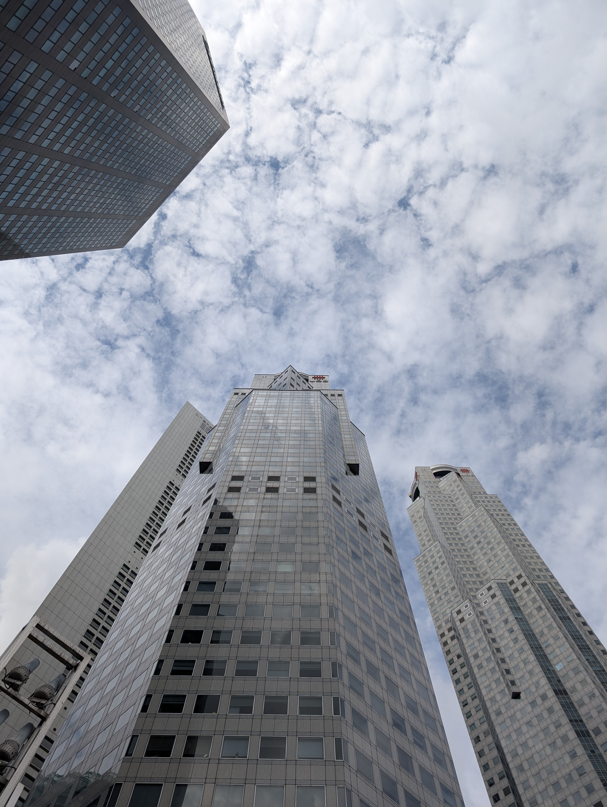
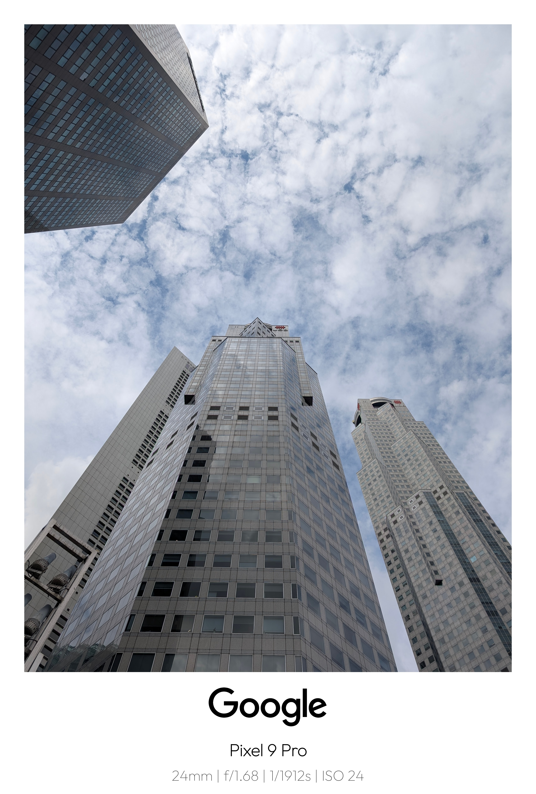

# 📸 AutoFrame for Android

**AutoFrame** is a smart and stylish Android application that automatically or manually creates beautifully framed copies of your photos. It enriches your images with data-rich templates, giving them a professional and consistent look without any effort.

---

## ✨ Features

### 🎯 Automatic & Manual Framing

- **Automatic Service**  
  Enable the background service to automatically frame every new photo you take.

- **Manual Mode**  
  Manually select any photo from your device to frame it with your choice of template.

### 🖼️ Rich, Multi-Template System

- Choose from a variety of unique frame styles in a beautiful 2x2 grid with visual previews:
  - **Sunset Template**  
    A dynamic, modern frame with a gradient background derived from the photo’s own colors. Includes a toggle for a classic white-bordered version.
  - **Polaroid & Classic Styles**  
    Includes a classic white-bordered “Polaroid” look and a clean “Bottom Bar” template.
  - **Modern Blurred UI**  
    An elegant template using a blurred version of the photo as its background (for Android 12+).

### 📷 Data-Rich & Dynamic

- **Intelligent EXIF Data**  
  Automatically reads and displays your photo’s metadata (focal length, aperture, shutter speed, ISO).

- **Accurate Device Stamping**  
  Correctly identifies the camera’s make and model (e.g., _Samsung Galaxy S23 Ultra_, _Google Pixel 9 Pro_) from the photo’s metadata.

- **GPS & Date Info**  
  The Sunset template elegantly displays GPS coordinates and date of capture.

- **Custom Device Names**  
  Set your own custom device name to be used on all frames.

### 🖼️ Beautiful In-App Gallery

- View all your framed photos in a dedicated gallery, intelligently grouped by date.
- Switch between a dynamic staggered grid and a uniform grid layout.
- Select multiple photos to **share** or **delete** at once.
- Tap any photo to view it in a **full-screen, zoomable viewer** that supports HDR and quick actions.

### 🔍 High-Quality & Robust

- Preserves the original photo’s resolution and properly handles all EXIF orientation tags.
- Saves all framed photos into a dedicated **“AutoFramed”** album.
- Optimized for performance and battery life using modern Android APIs like `WorkManager` and `ContentObserver`.
- **Ultra HDR Compatible:** Preserves and displays Ultra HDR gain maps for brilliant, high-contrast photos on compatible devices. 

> What is **Ultra HDR**?
Ultra HDR & Gain Map Support: Go beyond standard brightness. Ultra HDR allows photos to display incredibly bright highlights and deep, detailed shadows on compatible screens. AutoFrame preserves the original gain map—the data that tells the screen how to produce this brilliant, high-contrast look—ensuring your framed photos retain their full dynamic range and visual pop. 

---

## 🚀 Getting Started

You can download the latest **release APK** from the [Releases section](https://github.com/viditnakhawa/PhotoWatermarkCard/releases) of this GitHub repo.

> No need to clone or build — just install and go!

---

## 📱 How to Use

### ✅ Manual Framing

1. Tap the ➕ button on the gallery screen to select a photo.
2. Choose a template from the list to apply it instantly.

### 🔄 Automatic Framing

1. Go to **“Choose a Template”** from the gallery bottom bar.
2. Select your preferred default template.
3. Open **“Automation Settings”** and enable the background service.
4. Done! Take a picture, and a framed version will appear shortly in your **“AutoFramed”** album.

---

## 🛠️ Built With

- **Kotlin** – The official language for modern Android development.
- **Jetpack Compose** – Entire UI is built using declarative Compose.
- **Coil** – For efficient image loading and caching.
- **WorkManager** – For reliable and efficient background processing.
- **ContentObserver** – Detects new photos in real-time.
- **Canvas API** – For fast, in-memory image manipulation and frame rendering.
- **ExifInterface** – Reads and writes image metadata like shutter speed, ISO, etc.
- **Palette API** – Extracts dynamic colors from photos for vibrant templates.

---

## 📸 Sample Result (Before & After)

Here's a quick example of how AutoFrame transforms your photos:

| Original                     | AutoFramed                 |
|------------------------------|----------------------------|
|  |  |

> _Polaroid template with EXIF overlay and device branding applied automatically._

---

## 🧭 What's Next

While most core features are complete, future enhancements may include:

- 🔖 Edit Functionality & support images from multiple devices (DSLRs, SLRs, Mirror-less Cams)
- 🧠 Smart suggestions based on photo content
- 🌙 Dark mode UI customization
- ✨ AI-based captions or scene understanding (Gemini Nano)

---

## 🤝 Contributing

Contributions are welcome!  
If you’d like to report a bug, suggest a feature, or contribute code, feel free to [open an issue](https://github.com/viditnakhawa/PhotoWatermarkCard/issues) or submit a pull request.

---

> 📂 _AutoFrame makes your photography workflow cleaner, faster, and more aesthetic — all automatically._
